#### GET

```bash
  /app_forms
```
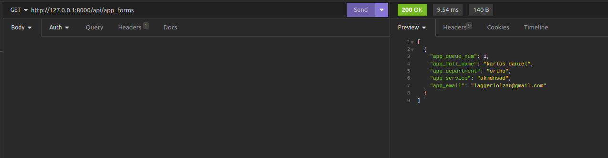

```bash
  /usr_acc
```
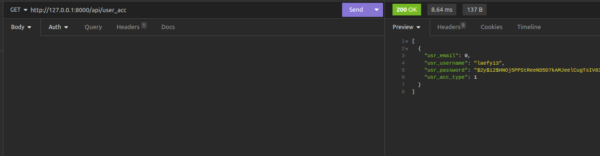

```bash
  /ptnt_prof
```
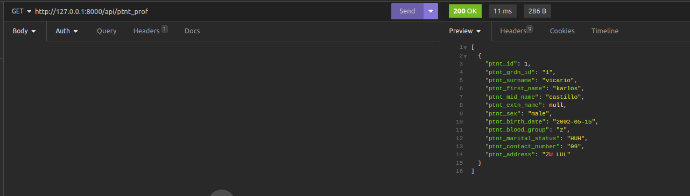

```bash
  /procd_form
```
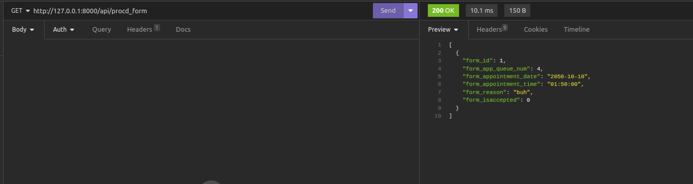

```bash
  /allergies
```
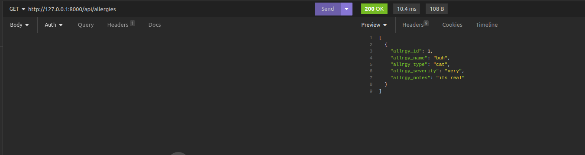

```bash
  /logs
```
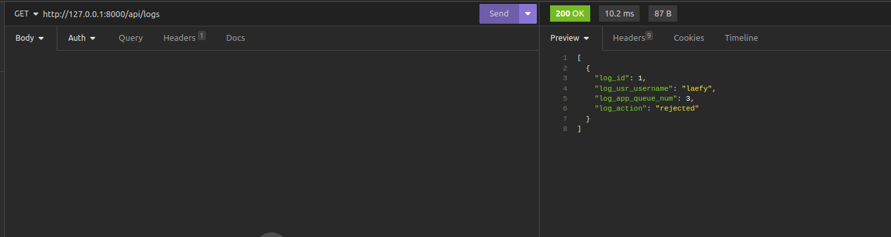

```bash
  /pat_allergies
```
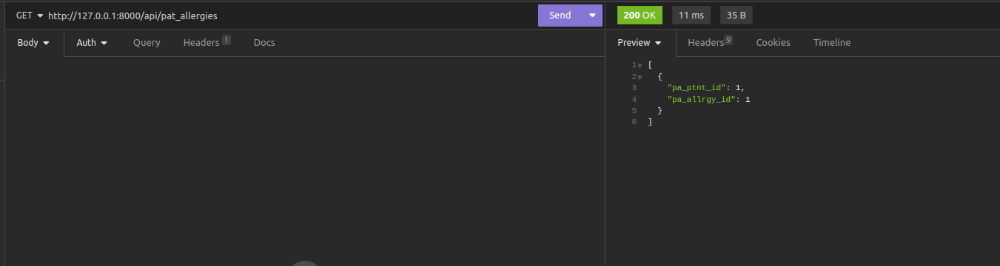

```bash
  /lab_rep
```
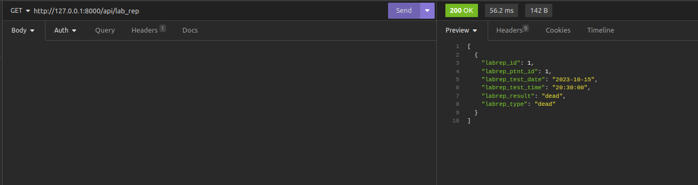

```bash
  /med_his
```
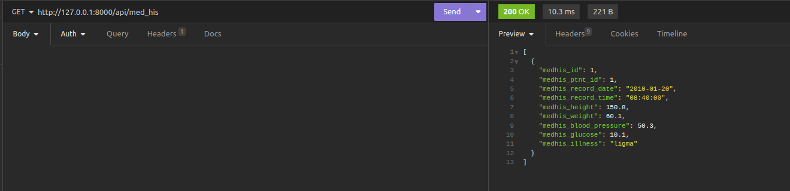

```bash
  /grdn_prof
```
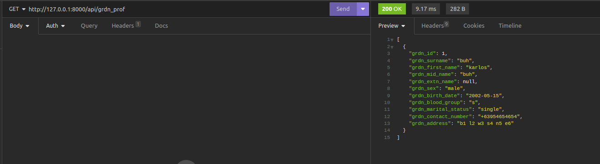

```bash
  /prescr
```


```bash
  /pd
```


```bash
  /drugs
```
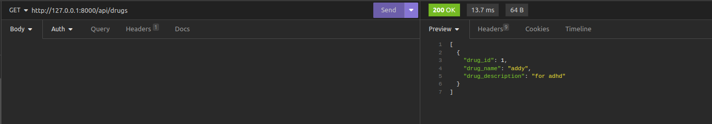

```bash
  /doctor_prof
```
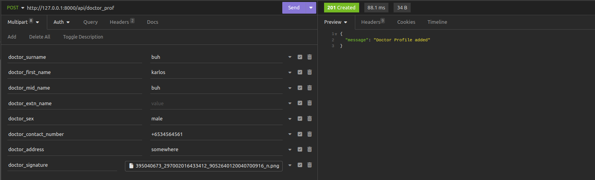