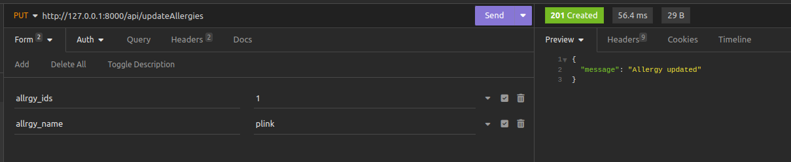
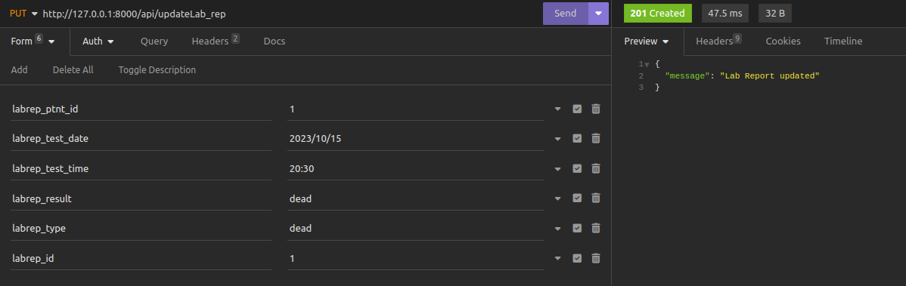

#### PUT
* tested with Form URL Encoded (which what I mostly used in the samples)
     * sample : /api/updateLabRep/labrep_ptnt_id=1&labrep_test_date=2023%2F10%2F15&labrep_test_time=20%3A30&labrep_result=dead&labrep_type=dead&labrep_id=1
* also tested with Multipart Form, but the request would have to be a POSt with a key '_method' and variable 'PUT'. Example:

* the Form URL Encoded is recommended for the most requests, while the Multipart Form is recommended for requests where a file will also be sent, like in the Doctor Profile

```bash
  /updateApp_forms
```


```bash
  /updateAllergies
```


```bash
  /updateLogs
```


```bash
  /updateLab_rep
```


```bash
  /updateGrdn_prof
```


```bash
  /updateDrugs
```


```bash
  /updateDoctor_prof
```
