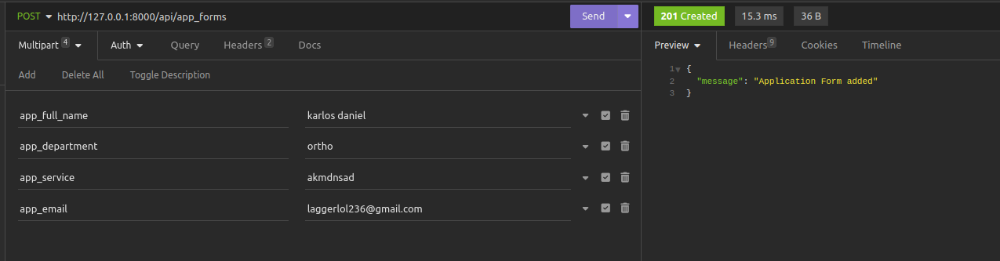
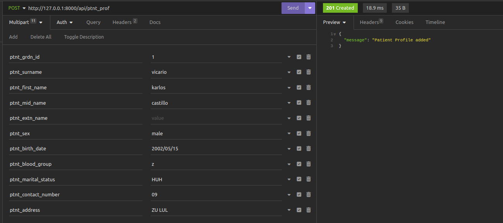
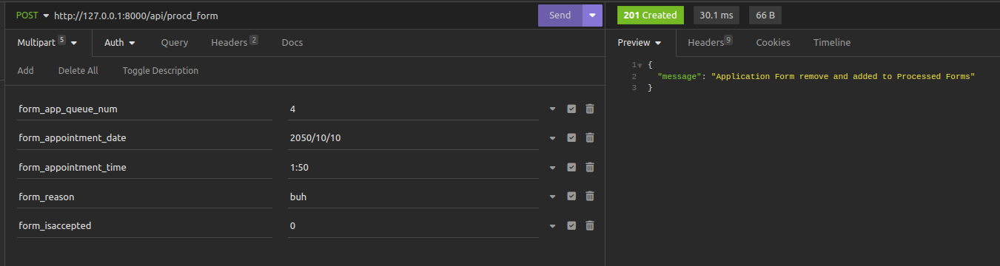
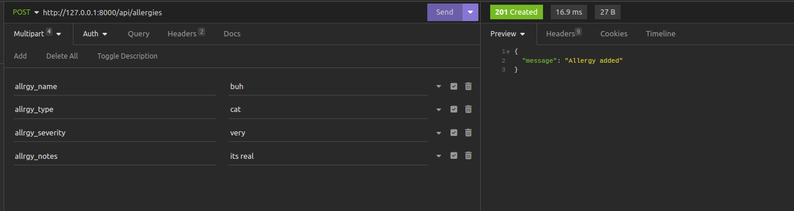
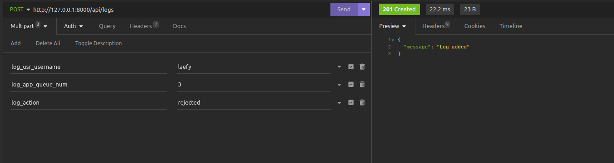
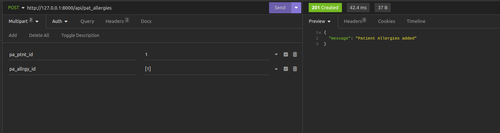
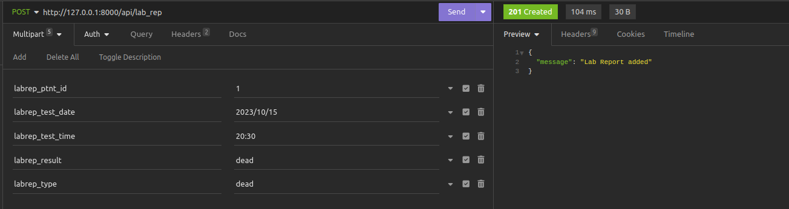
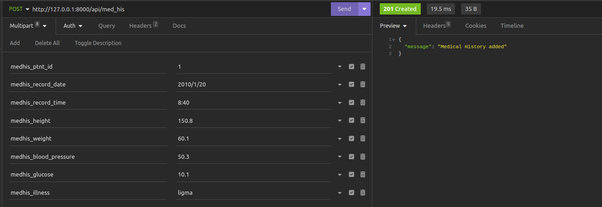
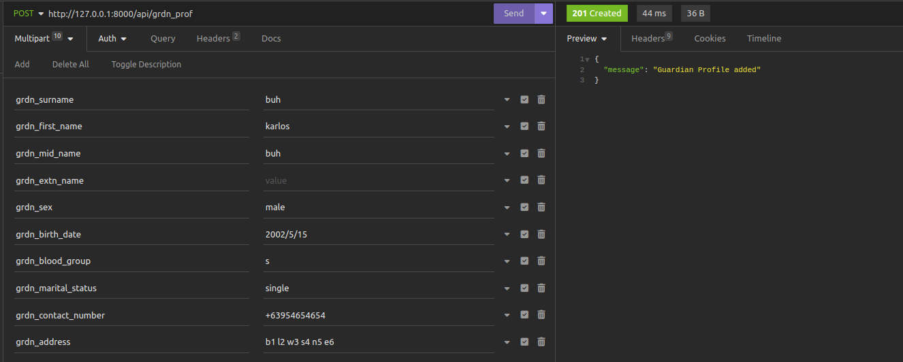

# VitalSynch Server

The repository that contains the development server of the VitalSycnh

## How to run the server to local environment

- Clone the repo
- Run in terminal

```bash
php artisan migrate
php artisan serve
```

## API Reference
#### GET
* check GET.md for the api route with image samples
```bash
  /app_forms
  /usr_acc
  /ptnt_prof
  /procd_form
  /allergies
  /logs
  /pat_allergies
  /lab_rep
  /med_his
  /grdn_prof
```

#### POST
* only tested with multipart form yet

```bash
  /app_forms
```


```bash
  /usr_acc
```


```bash
  /ptnt_prof
```


```bash
  /procd_form
```


```bash
  /allergies
```


```bash
  /logs
```


```bash
  /pat_allergies
```


```bash
  /lab_rep
```


```bash
  /med_his
```


```bash
  /grdn_prof
```



## Changes
* Dec 9, 2023
     * lab_rep, med_his, grdn_prof api routes
     * GET.md
