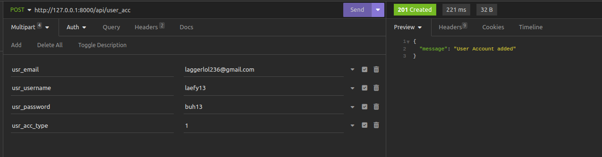

# VitalSynch Server

The repository that contains the development server of the VitalSycnh

## Dependencies
- Composer 2.2.6 2022-02-04 17:00:38 or higher
- PHP 8.2.13 (cli) (built: Nov 24 2023 08:47:18) or higher
- cloudinary configs in .env (ask me for the cloudinary configs if needed)

## How to run the server to local environment

- Clone the repo
- Run in terminal

```bash
composer install 
php artisan migrate
php artisan storage:link
php artisan serve
```
## Reminder
* Login API currently just returns a token, but you can just move all of the routes, and configure to have the token as a header to test how the API with login security works.
* The PDF generator for Prescription is just a sample, and is there just to show and get a feel on how PDF generator will work.

## API Reference
#### GET
* check GET.md for the api route with image samples
```bash
  /app_forms
  /usr_acc
  /ptnt_prof
  /procd_form
  /allergies
  /logs
  /pat_allergies
  /lab_rep
  /med_his
  /grdn_prof
```

#### GET only PKs and some names
* check GET.md for the api route with image samples
```bash
  /pkApp_forms
  /pkUsr_acc
  /pkPtnt_prof
  /pkProcd_form
  /pkAllergies
  /pkLogs
  /pkLab_rep
  /pkMed_his
  /pkGrdn_prof
```

#### PUT
* check PUT.md for the api route with image samples
```bash
  /updateApp_forms
  /updateUsr_acc
  /updatePtnt_prof
  /updateProcd_form
  /updateAllergies
  /updateLogs
  /updatePat_allergies
  /updateLab_rep
  /updateMed_his
  /updateGrdn_prof
```

#### POST
* only tested with multipart form yet

```bash
  /login
```


```bash
  /prescrViewPDF
```


```bash
  /app_forms
```


```bash
  /usr_acc
```


```bash
  /ptnt_prof
```


```bash
  /procd_form
```


```bash
  /allergies
```


```bash
  /logs
```


```bash
  /pat_allergies
```


```bash
  /lab_rep
```


```bash
  /med_his
```


```bash
  /grdn_prof
```


```bash
  /prescr
```


```bash
  /pd
```


```bash
  /drugs
```


```bash
  /doctor_prof
```


## Changes
* Dec 9, 2023
     * lab_rep, med_his, grdn_prof api routes
     * GET.md
     * prescr, pd, drugs, doctor_prof api routes
* Dec 11, 2023
     * pk and update functions on the controllers of:
          * Allergies
          * AppForm
          * DoctorProfile
          * Drugs
          * GuardianProfile
          * LabReport
          * Logs
          * MedicalHistory
          * PatientAllergies
          * PatientProfile
          * Prescription
          * PrescriptionDrugs
          * ProcessedForms
          * UserAccounts
     * PUT.md
* Dec 12, 2023
     * login controller and configured somethings for login to work
     * prescrViewPDF as a PDF generator sample
* Dec 16, 2023
     * lil bit of readme and sql file 
* February 4, 2024
     * added single function for almost all controllers
     * added pdf for labreports
     * moved the routes to middlewares
     * made 'pd_prescr_id' & 'pd_drug_id' primary for tbl_prescr_drugs
     * made index of PatientAllergiesController use left join for more details


